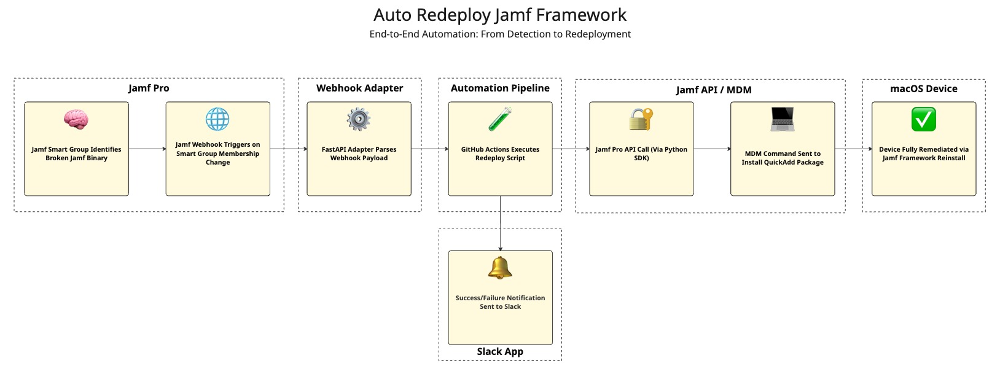

# Auto-Redeploy Jamf Framework

This project automates the redeployment of the Jamf management framework to macOS devices using Jamf Pro’s APIs. It proactively remediates stale or broken clients without manual intervention, using GitHub Actions and optionally a FastAPI webhook adapter for real-time response.

> "In some situations, a managed computer can enter a state where MDM commands process normally, but functionality that relies on the Jamf management framework is consistently failing. In this state, policies fail to execute and the Jamf Pro logs report "Device Signature" errors for the computer. 
>
> To restore management with the Jamf Pro server, the Jamf management framework should be reinstalled on the affected computer. As long as the MDM profile on the computer is still valid, you can use Jamf Pro to redeploy the Jamf management framework using the v1/jamf-management-framework/redeploy endpoint in the Jamf Pro API."
>
> — [Jamf Technical Article](https://learn.jamf.com/en-US/bundle/technical-articles/page/Redeploying_the_Jamf_Management_Framework_Using_the_Jamf_Pro_API.html)

---
## 📺 Watch the Tutorial

[](https://youtu.be/HoNK7DBaMhw)
 
Learn how to deploy this project step-by-step, including the Jamf configuration, GitHub Actions setup, and optional real-time webhooks using FastAPI.
 
---

## 📚 Table of Contents

* [What It Does](#-what-it-does)
* [Architecture](#-architecture)
* [Jamf Configuration](#-jamf-configuration)
* [Repository Setup](#-repository-setup)
* [Usage](#-usage)
* [Advanced Setup](#-advanced-setup)
* [Slack Notifications](#-slack-notifications)
* [Notes](#-notes)
* [Credit](#-credit)

---

## ✅ What It Does

* Identifies devices with a broken Jamf binary
* Triggers a `POST /v1/jamf-management-framework/redeploy/{id}` API call
* Uses MDM to silently reinstall the Jamf Framework via `QuickAdd.pkg`
* Confirms execution via returned `deviceId` and `commandUuid`

---

## 🧭 Architecture



---

## ⚙️ Jamf Configuration

### 1. Configuration Profile

* Create a configuration profile with no payloads (acts as a marker)
* Assign it to Smart Group A

#### Preference Domain (set to whatever you want):
```xml
com.jp-cpe.null
```
#### Application & Custom Settings Payload:
```xml
<?xml version="1.0" encoding="UTF-8"?>
<!DOCTYPE plist PUBLIC "-//Apple//DTD PLIST 1.0//EN" "http://www.apple.com/DTDs/PropertyList-1.0.dtd">
<plist version="1.0">
  <dict>
    <key>null</key>
    <true/>
  </dict>
</plist>
```


### 2. Smart Groups

* **Group A**: `Not Checked In (14+ Days)`
* **Group B**: `Not Checked In (14+ Days) + Null Profile Installed`

> Group A is used to scope the configuration profile.
> Group B is the target for the redeploy command.

### 3. API Client
- Create an API Role & API Client with these privileges:
  - `Send Computer Remote Command to Install Package`
  - `Read Computer Check-In`
  - `Read Smart Computer Groups`

---

## 📋 Repository Setup

1. **Clone or Template this Repository**

2. **Add Secrets to GitHub** (`Settings > Secrets and Variables > Actions`):

    - `GROUP_ID` (the ID of **Group B**)
    - `JAMF_BASE_URL` (the URL of your Jamf server: **company.jamfcloud.com**)
    - `JAMF_CLIENT_ID` (the client ID of your API client)
    - `JAMF_CLIENT_SECRET` (the client secret of your API client)

3. Remove the comment from the `schedule:` section of the **scheduled-redeploy-jamf-framework** workflow YAML
---

## 🧪 Usage

### Manual Run

Go to **Actions** → **Scheduled Jamf Framework Redeploy** → *Run workflow*

### Scheduled Run

Runs every Monday at 2:00 AM UTC by default:

```yaml
schedule:
  - cron: '0 2 * * 1'  # Sunday 7 PM PT
```

To disable, remove the `schedule:` section from the workflow YAML.

### Example Output

```json
[
  { "deviceId": "000", "commandUuid": "9ee7f9a8-bf4f-4d0c-aa7e-38c983681c8a" },
  { "deviceId": "123", "commandUuid": "5e489e68-3704-40b9-b781-bdb04225f9eb" }
]
```

---

## ⚡ Advanced Setup

> Want real-time redeploys? Follow these steps to set up a webhook-driven FastAPI service on Fly.io.

See: [docs/webhook-setup.md](docs/webhook-setup.md)

Includes:

* Generating a webhook secret
* Creating a GitHub PAT
* Deploying FastAPI to Fly.io
* Configuring a Jamf webhook for Smart Group membership change

---

## 📣 Slack Notifications

1. Create a new app at [https://api.slack.com/apps/](https://api.slack.com/apps/)
2. Enable **Incoming Webhooks**
3. Add a webhook to your desired channel
4. Copy the webhook URL
5. Add it to GitHub Secrets as `SLACK_WEBHOOK`

---

## 📝 Notes

* Framework redeploys silently via MDM “Install Enterprise Application” command
* Device enters `Enrollment Complete` state and triggers re-enrollment workflows
* Expect delayed or backlogged policy execution on heavily stale devices

---

## 🙏 Credit

* Built using [Jamf Pro SDK for Python](https://github.com/macadmins/jamf-pro-sdk-python)
* Inspired by Mann Consulting’s [JNUC 2024 "Flawless MDM Communication"](https://github.com/mannconsulting/JNUC2024/)
